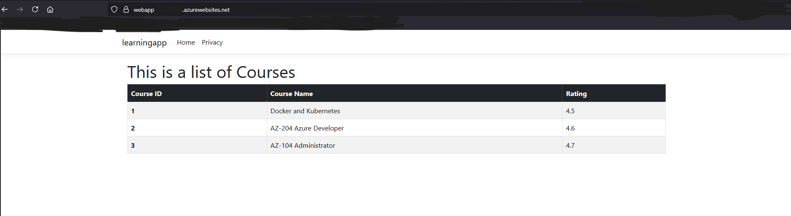
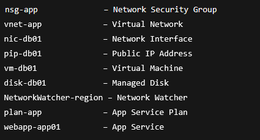
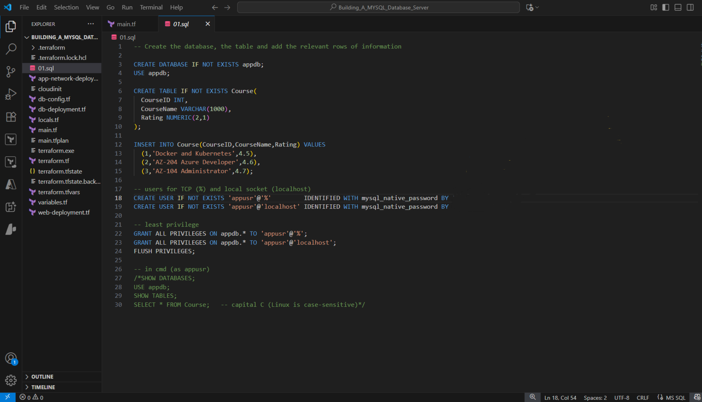
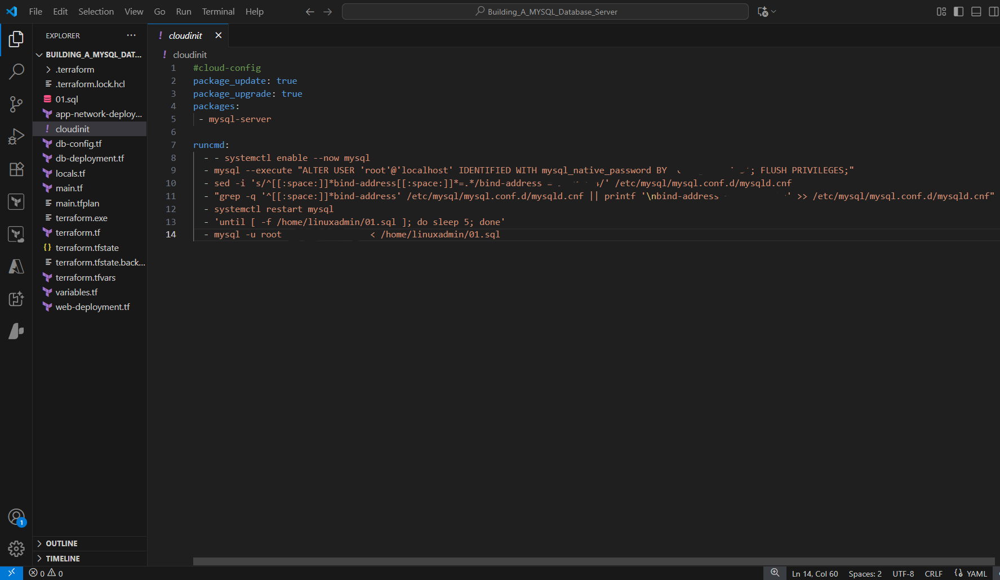
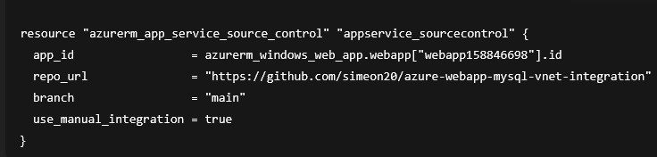

Azure Windows Web App with Private MySQL on Linux VM (Terraform Automated)
 
Project Overview

This project demonstrates a Terraform-automated deployment of a secure Azure environment where a Windows-based Azure Web App connects privately to a Linux Virtual Machine hosting a MySQL database.
 
 

---

The solution highlights:

Automate infrastructure with Terraform

Connect cross-platform components (Windows Web App ↔ Linux VM)

Enforce private networking using Azure VNets and NSGs

Deploy a public-facing app that communicates securely with a backend database

---

Architecture

Terraform IaC: Automates resource creation (VM, Web App, VNet, NSG, etc.)

Linux VM (Ubuntu): Runs the MySQL server

Azure Web App (Windows App Service): Hosts the frontend web application

Virtual Network (VNet): Provides private communication between app and database

NSGs: Restrict MySQL access to only the Web App subnet 

Public Internet Traffic: Only the Web App is exposed; the database is not directly accessible

---

Resources Created: 
 
 
 

 

[Linux Overview](Linux_VM_Overview.png)

 

---

Database Setup (MySQL):

SQL Initialization Script (01.sql) provisions:

appdb database and Course table

Inserts seed data:

Docker & Kubernetes (⭐ 4.5)

AZ-204 Azure Developer (⭐ 4.6)

AZ-104 Administrator (⭐ 4.7)

Creates least-privilege user appusr with role-based access

Configured for both remote TCP connections and localhost access
 
 

---

Cloud-Init Automation (MySQL Bootstrap):
 
 

Installs and configures MySQL server on the Linux VM.

Secures the root account with a strong password.

Configures MySQL to listen only on the private VNet IP.

Restarts MySQL and automatically runs the initialization script (01.sql).

Ensures the database, tables, seed data, and least-privilege user are created on first boot.
 
 

---

The Azure Web App is connected directly to this GitHub repository via Terraform:
 

This ensures that updates pushed to the main branch of the repo are automatically pulled into the App Service.

The application folder (containing the .NET frontend app) provides the code that gets deployed to the Web App. Terraform provisions the infra, while GitHub serves as the source of truth for the application code.
 

[Application folder](learningapp)
 
[Web Deployment](web_deployment_tf.png)

---

Security Highlights:

Database locked down to VNet-only traffic

Web App private tunneling via VNet integration (no public DB access)

NSGs restrict traffic 

Terraform automation ensures repeatability and no manual drift
 

[Web App Overview ](Webapp_Resource_Overview.png) 
[Web App deployment center](webapp_Deployment_center.png) 
[Web App deployment center logs](webapp_Deployment_Center_logs.png) 
[Integration](Webapp_Resource_Networking_Virtual_Network_Integration.png) 
[Connection String](Webapp_Resource_Environment_Variables.png) 

---

Key Skills Demonstrated:

Terraform Infrastructure as Code (IaC)

Linux VM setup & MySQL administration

Windows-based Azure Web App deployment

Cross-platform integration (Windows App Service → Linux MySQL)

Azure Virtual Networking & NSGs

Secure cloud architecture patterns

---

