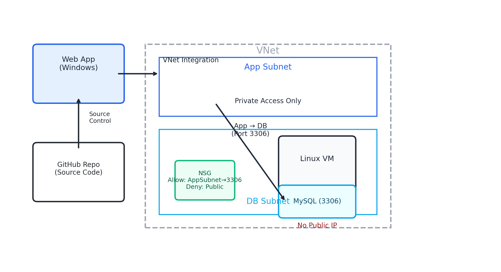

Azure Windows Web App with Private MySQL on Linux VM (Terraform Automated)
 
 
Project Overview:

This project demonstrates a Terraform-automated deployment of a secure Azure environment where a Windows-based Azure Web App connects privately to a Linux Virtual Machine hosting a MySQL database.
 
 

---

The solution highlights:

Automate infrastructure with Terraform

Connect cross-platform components (Windows Web App ↔ Linux VM)

Enforce private networking using Azure VNets and NSGs

Deploy a public-facing app that communicates securely with a backend database

---

Architecture

Terraform IaC to provision all core Azure resources (Resource Group, VNet, Subnets, NSGs, App Service Plan, Web App, and Linux VM).

Linux VM (Ubuntu) hosting a MySQL database, bootstrapped automatically with cloud-init (launching data when the machine starts).

Azure App Service (Windows) running the frontend application, integrated directly with GitHub for source control and continuous delivery.

Private VNet + NSGs ensuring only the Web App subnet can access MySQL (port 3306) while blocking public access.

End-to-end architecture demonstrating a real-world pattern: public-facing app ↔ private database backend.

---

Resources Created: 
 
 
 

 

[Linux Overview](Linux_VM_Overview.png)

 

---

Database Setup (MySQL):

SQL Initialization Script (01.sql) provisions:

appdb database and Course table

Inserts seed data:

Docker & Kubernetes (⭐ 4.5)

AZ-204 Azure Developer (⭐ 4.6)

AZ-104 Administrator (⭐ 4.7)

Creates least-privilege user appusr with role-based access

Configured for both remote TCP connections and localhost access
 
 

---

Cloud-Init Automation (MySQL Bootstrap):
 
 

Installs and configures MySQL server on the Linux VM.

Secures the root account with a strong password.

Configures MySQL to listen only on the private VNet IP.

Restarts MySQL and automatically runs the initialization script (01.sql).

Ensures the database, tables, seed data, and least-privilege user are created on first boot.
 
 

---

The Azure Web App is connected directly to this GitHub repository via Terraform:
 

This ensures that updates pushed to the main branch of the repo are automatically pulled into the App Service.

The application folder (containing the .NET frontend app) provides the code that gets deployed to the Web App. Terraform provisions the infra, while GitHub serves as the source of truth for the application code.
 

[Application folder](learningapp)
 
[Web Deployment](web_deployment_tf.png)

---

Security Highlights:

Database locked down to VNet-only traffic

Web App private tunneling via VNet integration (no public DB access)

NSGs restrict traffic 

Terraform automation ensures repeatability and no manual drift
 

[Web App Overview ](Webapp_Resource_Overview.png) 
[Web App deployment center](webapp_Deployment_center.png) 
[Web App deployment center logs](webapp_Deployment_Center_logs.png) 
[Integration](Webapp_Resource_Networking_Virtual_Network_Integration.png) 
[Connection String](Webapp_Resource_Environment_Variables.png) 

---

Key Skills Demonstrated:

Terraform Infrastructure as Code (IaC)

Linux VM setup & MySQL administration

Windows-based Azure Web App deployment

Cross-platform integration (Windows App Service → Linux MySQL)

Azure Virtual Networking & NSGs

Secure cloud architecture patterns

---
Terraform Configuration Files:
 
[main](main_tf.png) 
[locals](locals_tf.png) 
[Webb App Network Deployment](APP_Network_Deployment_tf.png) 
[Database Config](db_Config_tf.png) 
[Database deployment](db_deployment_tf.png) 
[Terraform](Terraform_tf.png) 
[variables](variables_tf.png) 
[Terraform Var](Terraform_tf_vars.png) 

---

Terraform Instructions:
 
Authenticate with Azure: (az login, az account set --subscription "your-subscription-id")
 
Initialize Terraform (terraform init)
 
Validate configuration (terraform validate)
 
Plan deployment (terraform plan -out main.tfplan)
 
Apply deployment(terraform apply "main.tfplan")
 
Access the App (Terraform outputs the Web App URL after deployment. Open it in a browser to confirm connectivity with the MySQL database.)
 
Destroy resources -optional (terraform destroy)
 

---

Conclusion:
 
 
This project demonstrates how to design and deploy a secure, automated, and scalable cloud architecture on Azure by combining:

    Infrastructure as Code (Terraform) for repeatable, version-controlled deployments

    Azure App Service integrated with GitHub for continuous delivery of application code

    Linux VM with MySQL bootstrapped via cloud-init for hands-off database provisioning

    Private VNet + NSGs enforcing least-privilege communication and blocking public exposure

By bringing these components together, the project highlights not only technical depth in cloud infrastructure and security, but also an automation-first mindset
